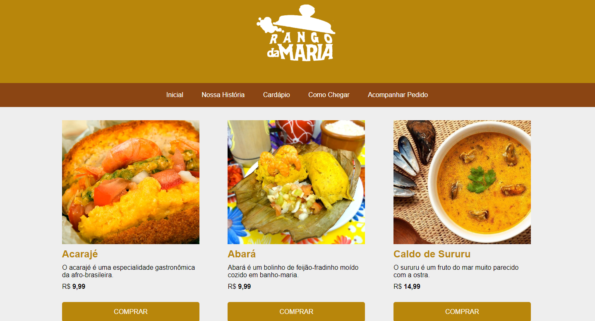
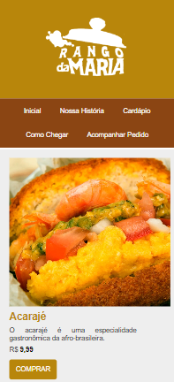

# Nome do Projeto 
<h1 align="center">Rango da Maria</h1>

# Descrição do Projeto

Rango da Maria é um projeto feito nas linguagens de marcação HTML e CSS, com objeto de fazer o primeiro projeto com meu irmão, que está apredendo essas linguagens de marcações.

# Responsividade
<h1 align="center">Desktop</h1>

<h1 align="center">Mobile</h1>
<h1 align="center">

</h1>

# Linguagens utilizadas
<h1 align="center">

Fontes de estudos das linguagens de marcações utilizadas

    <a href="https://developer.mozilla.org/pt-BR/docs/Learn/Getting_started_with_the_web/HTML_basics"> HTML</a>
    <a href="https://developer.mozilla.org/pt-BR/docs/Learn/Getting_started_with_the_web/CSS_basics"> CSS</a>
</h1>

# Autores
<h1 align="center">
    <a href="https://github.com/DevRemag"> DevRemag (Junio)</a>
    <a href="https://github.com/DevLeno"> DevLeno (Lenoir)</a>
</h1>

